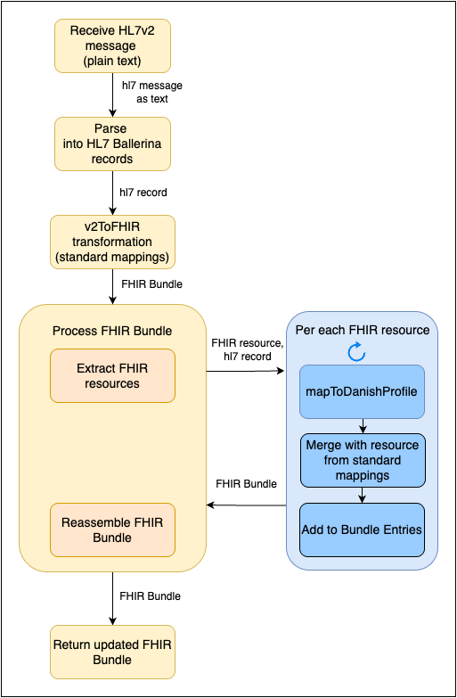

# Ballerina HL7v2 to Danish FHIR Converter

This project demonstrates how to use Ballerina's HL7v2 to FHIR conversion utilities along with the MedCom240 Ballerina library to convert standard HL7v2 messages into Danish FHIR resources (referring MedCom Implementation Guide version 2.4.0.)

## Overview

Healthcare interoperability in Denmark requires conformance to the MedCom FHIR profiles. This utility simplifies the process of converting legacy HL7v2 messages into MedCom-compliant FHIR resources, enabling seamless integration between legacy systems and modern FHIR-based healthcare platforms.

The process flow for this sample is illustrated in the following diagram.


## Features

- Convert HL7v2 ADT messages to MedCom FHIR resources
- Support for MedCom Implementation Guide v2.4.0 profiles
- Validation against Danish healthcare requirements
- Comprehensive error handling and logging

## Prerequisites

- [Ballerina](https://ballerina.io/downloads/) 2201.12.3 (Swan Lake) or newer
- Basic knowledge of HL7v2 and FHIR standards
- Knowledge of Danish healthcare standards and MedCom profiles

## HTTP Service
The transformation runs as an HTTP service. You can invoke the relevant endpoints with a valid HL7v2 ADT_A01 message to see the transformed FHIR resources. This allows for easy integration with existing systems that need to convert legacy HL7v2 messages to FHIR.

## Try Out

1. Clone this repository:
   ```bash
   git clone https://github.com/ballerina-guides/healthcare-samples.git
   cd working-with-fhir-igs/hl7v2-to-dk-medcom
   ```
2. Install dependencies:
   ```bash
   bal build
   ```
3. Start the server
   ```bash
   bal run
   ```

### V2toFHIR Transformation with Danish profiles
```bash
curl --location 'http://localhost:9090/hl7/transform' \
--header 'Content-Type: text/plain' \
--data 'MSH|^~\\&|ADT1|GOOD HEALTH HOSPITAL|GHH LAB, INC.|GOOD HEALTH HOSPITAL|198808181126|SECURITY|ADT^A01^ADT_A01|MSG00001|P|2.3||
EVN|A01|200708181123||
PID|1||PATID1234^5^M11^ADT1^MR^GOOD HEALTH HOSPITAL~123456789^^^USSSA^SS||BATMAN^ADAM^A^III||19610615|M||C|2222 HOME STREET^^GREENSBORO^NC^27401-1020|GL|(555)555-2004|(555)555-2004||S||PATID12345001^2^M10^ADT1^AN^A|444333333|987654^NC|
NK1|1|NUCLEAR^NELDA^W|SPO^SPOUSE||||NK^NEXT OF KIN$
PV1|1|I|2000^2012^01||||004777^ATTEND^AARON^A|||SUR||||ADM|A0|'
```

Result will look as follows
```json
{
    "resourceType": "Bundle",
    "meta": {
        "profile": [
            "http://hl7.org/fhir/StructureDefinition/Bundle"
        ]
    },
    "type": "transaction",
    "entry": [
        {
            "resource": {
                "resourceType": "Patient",
                "id": "1",
                "meta": {
                    "profile": [
                        "http://medcomfhir.dk/ig/core/StructureDefinition/medcom-core-patient"
                    ]
                },
                "identifier": [
                    {
                        "value": "123456789"
                    },
                    {
                        "system": "urn:oid:1.2.208.176.1.2",
                        "value": "01f02594-6ba7-1500-96f1-59ce4ea7a561"
                    }
                ],
                "generalPractitioner": [
                    {
                        "identifier": {
                            "use": "official",
                            "system": "urn:oid:1.2.208.176.1.1",
                            "value": ""
                        }
                    }
                ],
                "name": [
                    {
                        "given": [
                            "ADAM"
                        ],
                        "use": "official",
                        "family": "BATMAN"
                    }
                ]
            }
        },
        {
            "resource": {
                "resourceType": "Patient",
                "id": "1",
                "meta": {
                    "profile": [
                        "http://medcomfhir.dk/ig/core/StructureDefinition/medcom-core-patient"
                    ]
                },
                "identifier": [
                    {
                        "value": "123456789"
                    },
                    {
                        "system": "urn:oid:1.2.208.176.1.2",
                        "value": "01f02594-6ba7-1500-b489-cb5b7edc3ebd"
                    }
                ],
                "generalPractitioner": [
                    {
                        "identifier": {
                            "use": "official",
                            "system": "urn:oid:1.2.208.176.1.1",
                            "value": ""
                        }
                    }
                ],
                "name": [
                    {
                        "given": [
                            "ADAM"
                        ],
                        "use": "official",
                        "family": "BATMAN"
                    }
                ]
            }
        },
        {
            "resource": {
                "resourceType": "Encounter",
                "meta": {
                    "profile": [
                        "http://medcomfhir.dk/ig/core/StructureDefinition/medcom-core-patient"
                    ]
                },
                "subject": {},
                "class": {
                    "code": "IMP"
                },
                "status": "in-progress"
            }
        }
    ]
}
```
